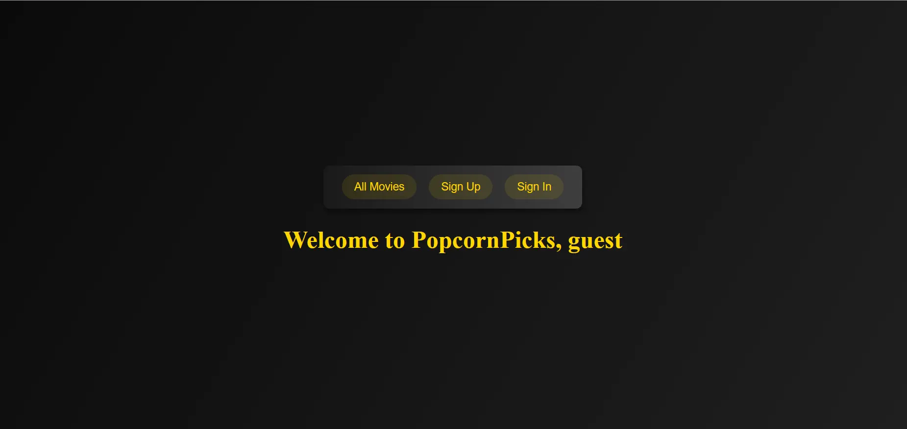

# PopcornPicks

**PopcornPicks** is a simple movies reviewing web application that is designed to have a elegant interface so movie lovers could enjoy reading and reviewing their favorites movies. I have choose to built this web application because of my huge enthusiasm towards movies and I personally like to discuss and engage with people about movies.

Here is a _Photo_ of the landing page of the web application:

and here is a git-hub link for the project: [Git-Hub](https://github.com/Leoloay/PopcornPicks.git)

## Attributions:

During the development of this express app I have utilized some of the dependencies for to enable the CRUD functionalities such as:

- **Express:** main event to build the back-end app
- **Express Session**: To help in making sessions for every user.
- **Morgan:** to help through routing
- **Method-Override:** To override some functionalities that Web applications won't do.
- **bcrypt:** To help with the encryption.
- **EJS:** to build ejs files.
- **Mongoose:** To help connection with the back end.

## Technologies used:

- Through out this project I have utilized the basic types of CRUD functionalities using **_Node.js_**, such as to create a user, login and authorize a user, and also the app aim is to create a meta database, that is why the app lets the user use the create functionality and add movies, but I have added the Admin user which he only can have an access to the added movies and accept, or delete them.
- As for the routes, I have implemented **_Node.js_** with **_Express_** to help with the routing to all various functionalities.
- I have also used EJS to build the html files for all the web pages, and inside the I have added an implementation of **_JS_**

## Next Steps:

Although the app is not what I have envisioned to the fullest, My upcoming goals and steps for this project is to add these features:

- _Favorite Movies:_ The ability to have a list of movies that the user adds that are his favorite.
- _Watch-list:_ to have a list of movies that the user didn't watch and would like to watch it in the near future.
- _Like and Unlike:_ the ability for the user to add like movies, reviews.
- _Posters of the movies:_ To see the poster of the movie that will be added.
